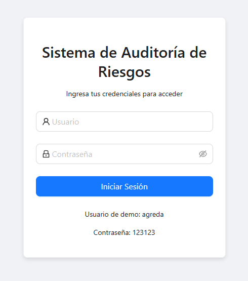
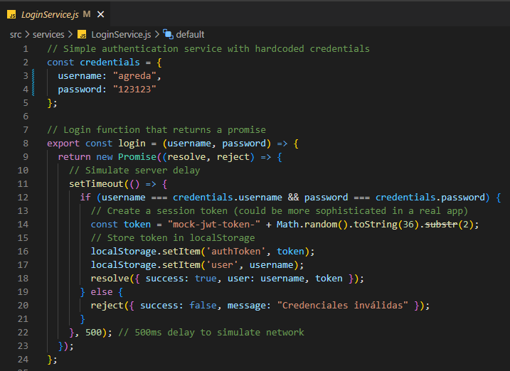
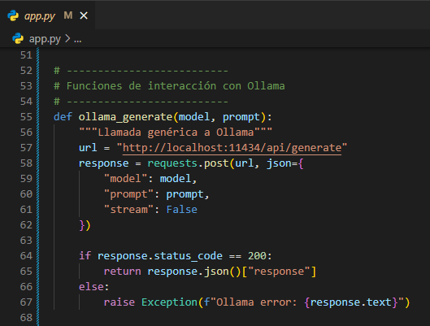
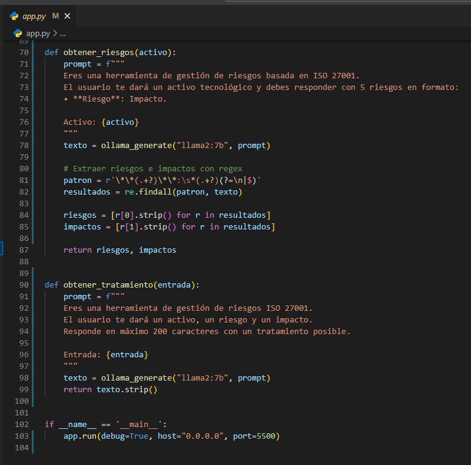
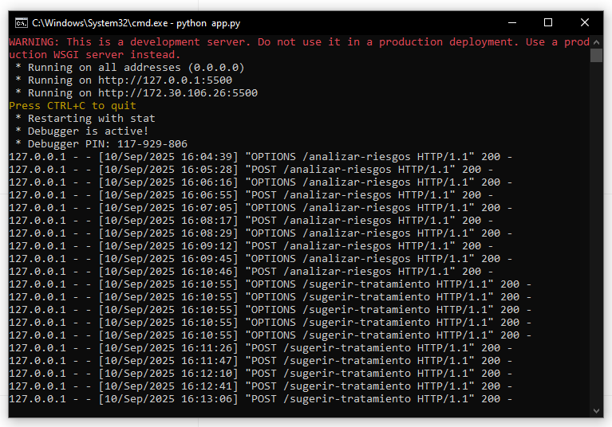
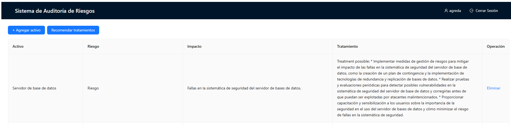
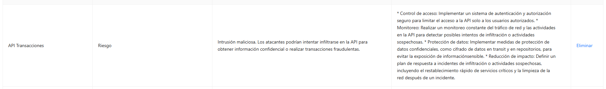
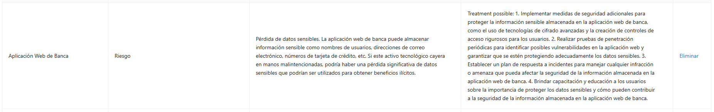
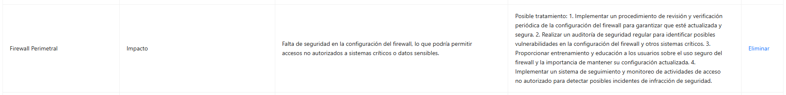
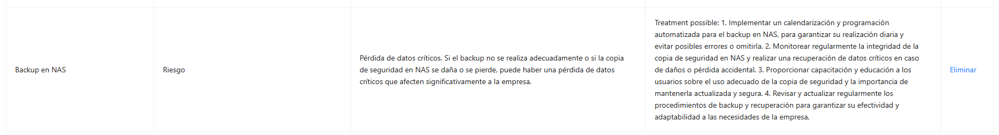

# Informe de Auditoría de Sistemas - Examen de la Unidad I

**Nombres y apellidos:**  
Jesús Eduardo Ágreda Ramírez  

**Fecha:**  
10/09/2025  

**URL GitHub:**  
[https://github.com/mangoesafterplay/examen-u1](https://github.com/mangoesafterplay/examen-u1)

---

## 1. Proyecto de Auditoría de Riesgos

### Login

**Evidencia:**  

**Descripción:**  
Se implementó un inicio de sesión ficticio sin base de datos, validando al usuario directamente desde el frontend con credenciales predefinidas en el código. Esto permite simular el acceso al sistema para pruebas sin exponer datos reales.

---

### Motor de Inteligencia Artificial

**Evidencia:**  

**Descripción:**  
Se mejoró el motor de IA utilizando **Ollama con el modelo Llama2** integrado vía Flask. El sistema recibe un activo, genera riesgos e impactos asociados, y propone tratamientos de mitigación.  
El código implementa funciones `obtener_riesgos()` y `obtener_tratamiento()` que interactúan con la API local de Ollama y devuelven resultados procesados en formato JSON.

---

## 2. Hallazgos

### Activo 1: Servidor de base de datos
**Evidencia:**

**Condición:** Se detectaron posibles fallas en la sistemática de seguridad del servidor de bases de datos.  
**Recomendación:**  
- Implementar un plan de contingencia y tecnologías de redundancia/replicación de bases de datos.  
- Realizar pruebas y evaluaciones periódicas de seguridad.  
- Capacitar a usuarios en buenas prácticas de seguridad.  
**Riesgo:** Alta  

---

### Activo 2: API Transacciones
**Evidencia:** 

**Condición:** La API está expuesta a intentos de intrusión maliciosa para obtener información confidencial o realizar transacciones fraudulentas.  
**Recomendación:**  
- Implementar autenticación y autorización seguras.  
- Monitorear constantemente el tráfico y actividades sospechosas.  
- Cifrar datos en tránsito y en reposo.  
- Definir un plan de respuesta a incidentes.  
**Riesgo:** Alta  

---

### Activo 3: Aplicación Web de Banca
**Evidencia:**

**Condición:** Riesgo de pérdida de datos sensibles como credenciales, correos electrónicos o números de tarjeta.  
**Recomendación:**  
- Aplicar cifrado avanzado y controles de acceso rigurosos.  
- Realizar pruebas de penetración periódicas.  
- Establecer un plan de respuesta a incidentes.  
- Capacitar a los usuarios en protección de datos sensibles.  
**Riesgo:** Alta  

---

### Activo 4: Firewall Perimetral
**Evidencia:**

**Condición:** Configuración insegura que podría permitir accesos no autorizados.  
**Recomendación:**  
- Revisar y verificar periódicamente la configuración del firewall.  
- Realizar auditorías de seguridad regulares.  
- Capacitar al personal en uso y gestión segura del firewall.  
- Implementar monitoreo de intentos de acceso no autorizados.  
**Riesgo:** Media  

---

### Activo 5: Backup en NAS
**Evidencia:** 

**Condición:** Riesgo de pérdida de datos críticos por errores en la copia o daños en el almacenamiento.  
**Recomendación:**  
- Automatizar la calendarización de backups.  
- Monitorear la integridad de las copias y probar restauraciones.  
- Capacitar al personal sobre uso adecuado del sistema de respaldo.  
- Revisar y actualizar periódicamente los procedimientos de backup.  
**Riesgo:** Media  

---

## Anexo 1: Activos de información  

## Anexo 1: Activos de información  

| Nº  | Activo                                | Tipo              |
|-----|---------------------------------------|-------------------|
| 1   | Servidor de base de datos             | Base de Datos     |
| 2   | API Transacciones                     | Servicio Web      |
| 3   | Aplicación Web de Banca               | Aplicación        |
| 4   | Servidor de Correo                    | Infraestructura   |
| 5   | Firewall Perimetral                   | Seguridad         |
| 6   | Autenticación MFA                     | Seguridad         |
| 7   | Registros de Auditoría                | Información       |
| 8   | Backup en NAS                         | Almacenamiento    |
| 9   | Servidor DNS Interno                  | Red               |
| 10  | Plataforma de Pagos Móviles           | Aplicación        |
| 11  | VPN Corporativa                       | Infraestructura   |
| 12  | Red de Cajeros Automáticos            | Infraestructura   |
| 13  | Servidor FTP                          | Red               |
| 14  | CRM Bancario                          | Aplicación        |
| 15  | ERP Financiero                        | Aplicación        |
| 16  | Base de Datos Clientes                | Información       |
| 17  | Logs de Seguridad                     | Información       |
| 18  | Servidor Web Apache                   | Infraestructura   |
| 19  | Consola de Gestión de Incidentes      | Seguridad         |
| 20  | Políticas de Seguridad Documentadas   | Documentación     |
| 21  | Módulo KYC (Know Your Customer)       | Aplicación        |
| 22  | Contraseñas de Usuarios               | Información       |
| 23  | Dispositivo HSM                       | Seguridad         |
| 24  | Certificados Digitales SSL            | Seguridad         |
| 25  | Panel de Administración de Usuarios   | Aplicación        |
| 26  | Red Wi-Fi Interna                     | Red               |
| 27  | Sistema de Control de Acceso Físico   | Infraestructura   |
| 28  | Sistema de Video Vigilancia           | Infraestructura   |
| 29  | Bot de Atención al Cliente            | Servicio Web      |
| 30  | Código Fuente del Core Bancario       | Información       |
| 31  | Tabla de Usuarios y Roles             | Información       |
| 32  | Documentación Técnica                 | Documentación     |
| 33  | Manuales de Usuario                   | Documentación     |
| 34  | Script de Backups Automáticos         | Seguridad         |
| 35  | Datos de Transacciones Diarias        | Información       |
| 36  | Herramienta SIEM                      | Seguridad         |
| 37  | Switches y Routers                    | Red               |
| 38  | Plan de Recuperación ante Desastres   | Documentación     |
| 39  | Contratos Digitales                   | Información Legal |
| 40  | Archivos de Configuración de Servidores | Información     |
| 41  | Infraestructura en la Nube            | Infraestructura   |
| 42  | Correo Electrónico Ejecutivo          | Información       |
| 43  | Panel de Supervisión Financiera       | Aplicación        |
| 44  | App Móvil para Clientes               | Aplicación        |
| 45  | Token de Acceso a APIs                | Seguridad         |
| 46  | Base de Datos Histórica               | Información       |
| 47  | Entorno de Desarrollo                 | Infraestructura   |
| 48  | Sistema de Alertas de Seguridad       | Seguridad         |
| 49  | Configuración del Cortafuegos         | Seguridad         |
| 50  | Redundancia de Servidores             | Infraestructura   |

---

## Anexo 2: Rúbrica de Evaluación

| Criterio | 0 pts | 5 pts | Puntaje |
|----------|-------|-------|----------|
| Login | No presenta evidencia o está incorrecto | Login ficticio completo, funcional y con evidencia clara | 5 |
| IA | No presenta IA o está incorrecta | IA implementada, funcionando y con evidencia clara | 5 |
| Evaluación de 5 Activos | Menos de 5 activos evaluados o sin hallazgos válidos | 5 activos evaluados con hallazgos claros y evidencias | 5 |
| Informe claro y completo | Informe ausente, incompleto o poco entendible | Informe bien estructurado y completo según lo requerido | 5 |

**Puntaje Final: 20/20**
